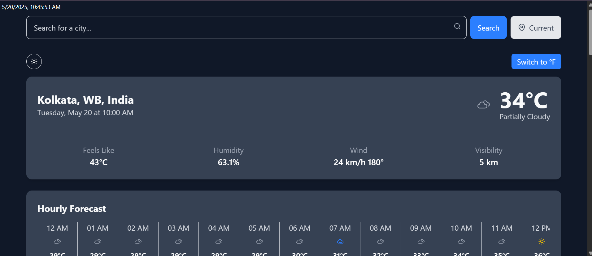
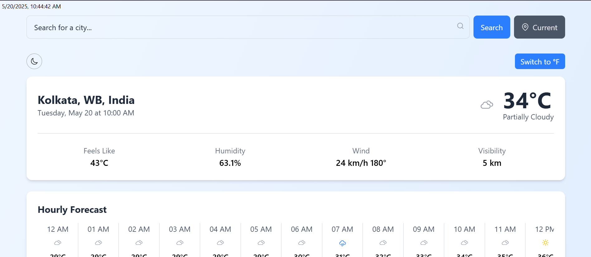

# 🌦️ React Weather App

A modern and responsive weather app built with **React** and **Tailwind CSS**, providing real-time weather data, hourly forecasts, and 15-day forecasts. Powered by the **Visual Crossing Weather API**, it supports location-based search, dark mode, and data visualization with Chart.js.

---

## 🔗 Live Demo

👉 [Check it out here](https://weather-app-snowy-two-19.vercel.app/)

---

## 📸 Screenshots

| Dark Mode                                 | Light Mode                                  |
| ----------------------------------------- | ------------------------------------------- |
|  |  |

---

## 🚀 Features

- 🔍 **Search by City** — Get weather details for any location
- 📍 **Current Location Detection** — Fetch weather using geolocation
- 🌡️ **Current Weather Display** — Temperature, condition, humidity, wind, UV index & more
- 🕒 **Real-Time Clock** — Local time display
- ⏳ **24-Hour Hourly Forecast** — With temperature and precipitation probability
- 📅 **15-Day Forecast** — Long-term weather trends with min/max temperature
- 📈 **Weather Chart** — Visualize temperature and rain trends with Chart.js
- 🌓 **Dark Mode** — Automatically saved preference using localStorage
- 📉 **Loading & Error States** — Responsive UI feedback
- 📱 **Fully Responsive UI** — Mobile to desktop friendly with Tailwind CSS

---

## 🧰 Tech Stack

- **Frontend**: React, Tailwind CSS, Chart.js, React Icons
- **APIs**: Visual Crossing Weather API, Geolocation API
- **Deployment**: Vercel

---

## 🧪 Getting Started

### 📦 Installation

- Clone the repo :

```bash
git clone https://github.com/PARTHA-PATTANAYAK-02/Weather_App.git
cd weather_app
```

- install dependencies:

```bash
npm install
```

- also see the package.json
- Create a .env file in the root and add:

```bash
VITE_WEATHER_API_KEY=your_visual_crossing_api_key

```

- Run the development server :

```bash
npm run dev
```

---

## 🌐 Deployment

## This project can be deployed easily using:

- ### 🔗 [vercel](https://weather-app-snowy-two-19.vercel.app/)

## ✍️ Author

### Made with ❤️ by Partha Pattanayak

- 🔗[Github](https://github.com/PARTHA-PATTANAYAK-02)
- 🔗[LinkedIn](https://www.linkedin.com/in/partha-pattanayak-082a46320/)
